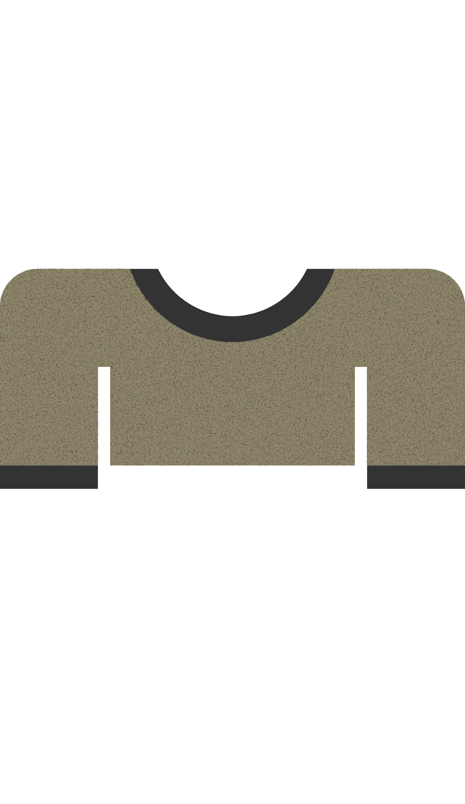
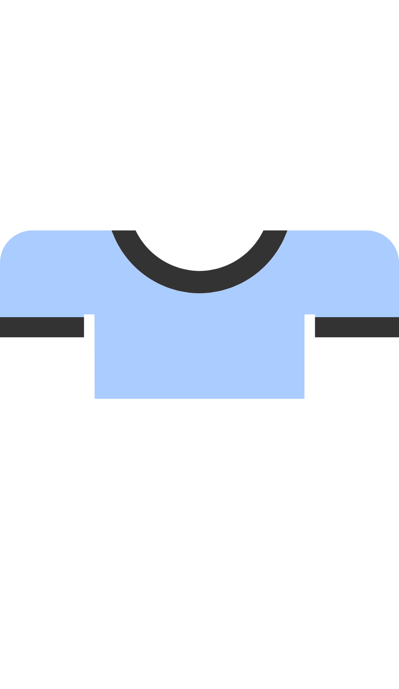
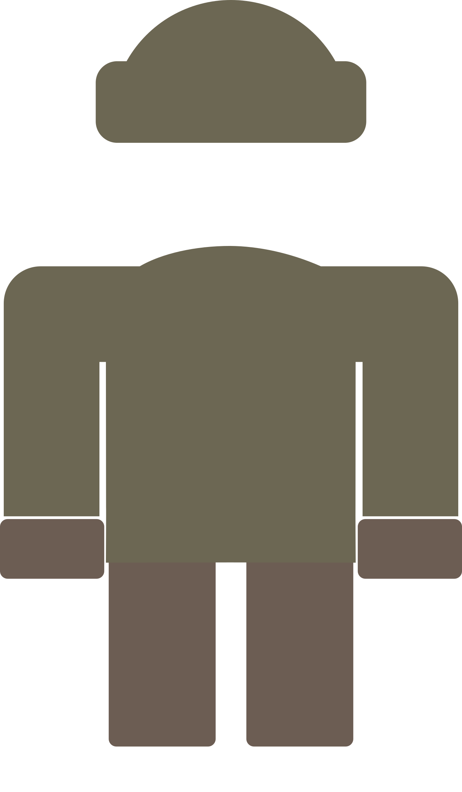
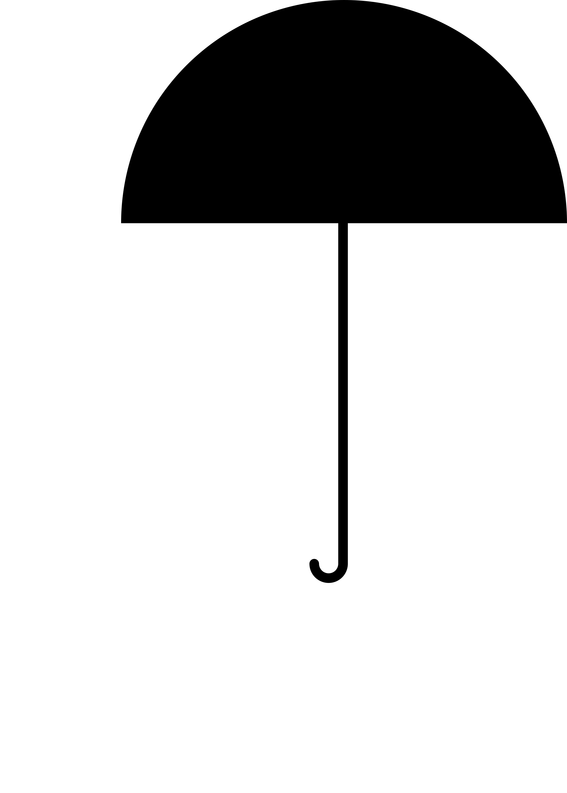
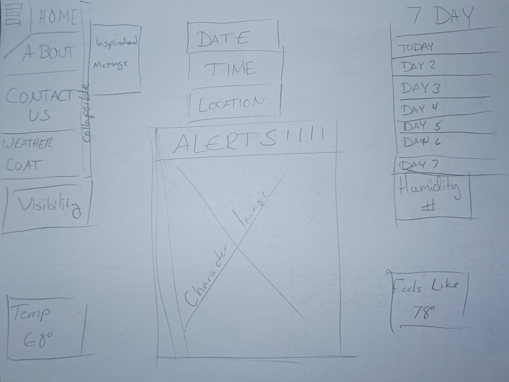
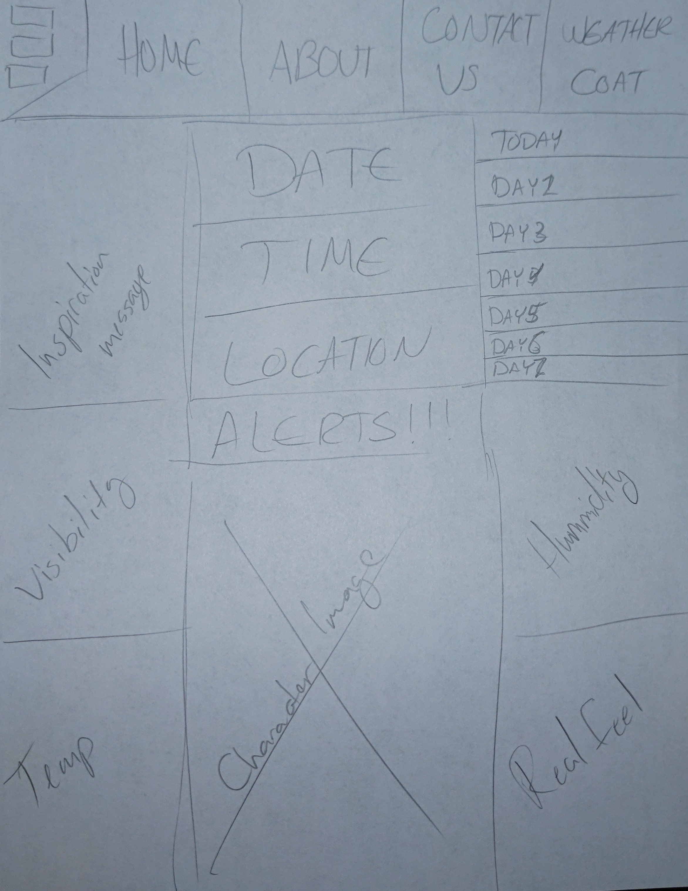

## Statement:
    I want to build an application that cutely shows what to wear depending on the weather for that day.

## Audience:
    The audience is everyone who wants to know what to wear that day.

## Outline of content:

  ### What do I want on each page? (text / pics / images / navigation)
      There will be an avatar in the center clothed to the weather.
      On the left and right of the avatar is going to be the temperature.
      Above the avatar is going to be the date/time/location.
      On the left hand side is going to be a pop out menu to the other pages.

  ### What do I want the functionality of each page to be?
      I want the app to be simple and give the information up front.
      They should immediately know what's going on when they see the page.

  ### What is the purpose of my application?
      To show everyone what would be good to wear for that day.

  ### What business problem or real world problem am I going to be solving?
      Bringing immediate information about what to wear form a single point.  Useable by everyone.
      Currently it is a little challenging to be able to get a good app for this.
      Most of them or ugly/messy or not on all platforms.

  ### Color Palette
      Blue to Red.  Blue being cold to red being hot.
      I want it to change from real feel to actual feel from bottom to top as the background.
      Giving a Color feel for the temperature of the day.
      Not sure if this is doable but I'm going to try

  ### Images
    - Avatar
  
  
  

    - Clothing
      - Sweater
  

      - Short Sleeves
  

      - Light Jacket
  

      - Winter Coat
  

      - Umbrella
  

      - Shorts
  

      - Jeans
  

      - Long Sleeves
  

      - Raincoat
  
 
      - Shoes
  

      - Sandals
  

      - Sun Glasses
  

    - Weather
      - Windy
      - Cloudy
      - Snow
      - Rain
      - Sun
      - Partly Cloudy
      - Moon Cycles?
      - Hail
      - Tornado
      - Hurricane

  ### Fonts
    - Not sure yet

  ### Logos
  

  ### Navigation
    - Home/About/Contact Us/WetherCoat(Name of the App)

  ### Story Map Link:
  https://app.mural.co/invitation/mural/eternity3362312/1674851431006?sender=ub5482ddfbce782f618b01415&key=c32e9966-536b-4ba8-872b-17c364a23298

## Research:
  ### Competition:
  Weather Fit
  https://weatherfit.com/
  - Apple Store App
  - Has cute little avatars but this is only for the iphone.

  Snafu
  https://play.google.com/store/apps/details?id=com.cksparc.snafuweather
  - Android and Apple App
  - Says it's a minimal app.
  - Seems to use random weird fashion pictures.

  ### My Benefits
  - Turning this into a web app I am looking to make this available to a wider audience.
  - They should be able to use it from any phone or PC.

## WireFrames:
  ### HOME:
    - LINK/IMAGES
  ### ABOUT:
    - LINK/IMAGES
  ### CONTACT US:
    - LINK/IMAGES
  ### WEATHERCOAT:
   
  
  
  
  

## User Flow:
  https://drive.google.com/file/d/11iTMsVSHwdv1IAyVWh_ZZdmDjvUvBbX-/view?usp=sharing

## SWOT Analysis:
  ### STRENGTHS:
    1. Available to everyone.
    2. Simple Design.
    3. Easy to Use.
  ### WEAKNESSES:
    1. Not a lot of options for avatar.
    2. With limiting space may not have enough information.
    3. Might not hit target location.
  ### OPPORTUNITIES:
    1. To show off skills.
    2. Could expand it with add ons.
    3. More wardrobe or avatar options.
  ### THREATS:
    1. Larger dev teams can put out something with more details or options.
    2. People love apps and this is a web page.
    3. Missing an audience.
